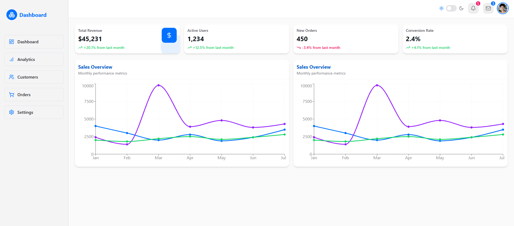
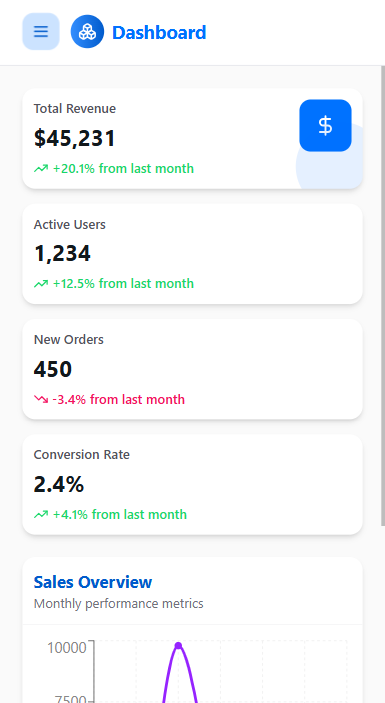

# 🧭 Next.js 15 + HeroUI + TailwindCSS Dashboard Boilerplate

A clean, production-ready **Next.js 15 App Router** dashboard starter built with:

- 🧩 [HeroUI](https://heroui.chat) modern components
- 🎨 TailwindCSS 3.4 for utility-first styling
- 💡 Dark / Light theme switch with persistence
- 📈 Recharts example integration
- 🧭 Mobile-responsive sidebar with drawer
- ⚡ Framer Motion for smooth animations
- ♻️ Fully reusable and scalable component structure

> **Perfect starter template** for SaaS apps, admin panels, analytics dashboards, and startup projects.

---

## 🔥 Features

- ✅ Next.js 15 App Router
- ✅ HeroUI + TailwindCSS integration
- ✅ Fully responsive (mobile/tablet/desktop)
- ✅ Dark / Light mode switching
- ✅ Mobile drawer with smooth slide-in animation
- ✅ Recharts Sales Chart Example
- ✅ Active sidebar item highlighting
- ✅ Reusable ProfileActions and Theme management hooks
- ✅ Clean project folder structure

---

## 📸 Preview





---

## 🧩 Technologies Used

- Next.js 15 App Router
- HeroUI
- Tailwind CSS
- Framer Motion
- Rechart

---

## 📦 Getting Started

```bash
git clone https://github.com/shibinvl/nextjs-dashboards-template.git
cd nextjs-dashboards-template
npm install
npm run dev

```
Open http://localhost:3000 in your browser.


## Built with ❤️ using Next.js, Tailwind, HeroUI, and a vision to help devs start faster.

---

## 🤝 Contributing
Pull requests and issues are welcome!
If this helped you, ⭐️ star the repo and share it with others.

## 🔗 Connect with Me
GitHub: @shibinvl

LinkedIn: [Shibin VL](https://www.linkedin.com/in/shibin-v-l-5b8180182) 

---


